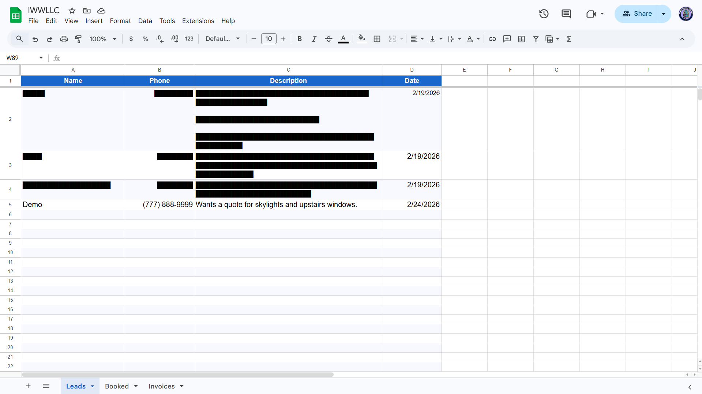

# Island Window Wizards LLC

We needed a frictionless way to generate invoices in the field, accept Crypto/Card instantly and track contacts without manual data entry.

I built this system to automate the entire lifecycle from a single Telegram interface.

## Demo

https://github.com/user-attachments/assets/ac738d38-bc6d-4323-976f-513ad6e1bf93

### Payment Interface
The customer invoice page (`pay.iwwllc.com`).

| Payment Selection        | Success & Receipt                |
| ------------------------ | -------------------------------- |
|  |  |

### Telegram Command Center
Managing leads and invoices directly from the chat.

| Lead Capture               | Invoice Generation               |
| -------------------------- | -------------------------------- |
|  |  |

### Automatic Data Sync
All data is instantly logged to the master Google Sheet for accounting.

## Architecture

### Telegram Bot
Acts as the command center. No external dashboard required. Quick and orderly entry.
*   **Invoicing:** `/invoice 450 "Window cleaning"` generates a unique payment link (`pay.iwwllc.com/?jobid=example`).
*   **CRM:** `/lead` and `/book` commands parse raw text and route it to the correct database.

### Payment Page
Headless React app hosted on our VPS backend and pointed to by our domain.
*   **Dynamic Pricing**: State management handles base price + tip calculation before initializing the payment intent. Applies discount if crypto is used.
*   **Gateways:**
    *   **Stripe:** Custom intent creation for Card payments.
    *   **Oxapay:** White label crypto checkout with custom UI. (USDC, BTC, ETH, etc.).

### Backend
*   **Google Sheets API:** Data persistence layer. Leads, Jobs, and Invoices are logged to specific tabs for organization and easy mobile access.
*   **Webhooks:** Listens for Stripe/Oxapay success events to trigger instant email receipts (via Resend) and update the sheet status to "PAID".

## Tech Stack 
*   **Frontend**: React, Vite, Tailwind CSS
*   **Backend**: Node.js, Fastify
*   **Infrastructure**: Nginx, PM2, Debian VPS
*   **Integrations**: Stripe, Oxapay, Google Sheets API, Telegram Bot API
